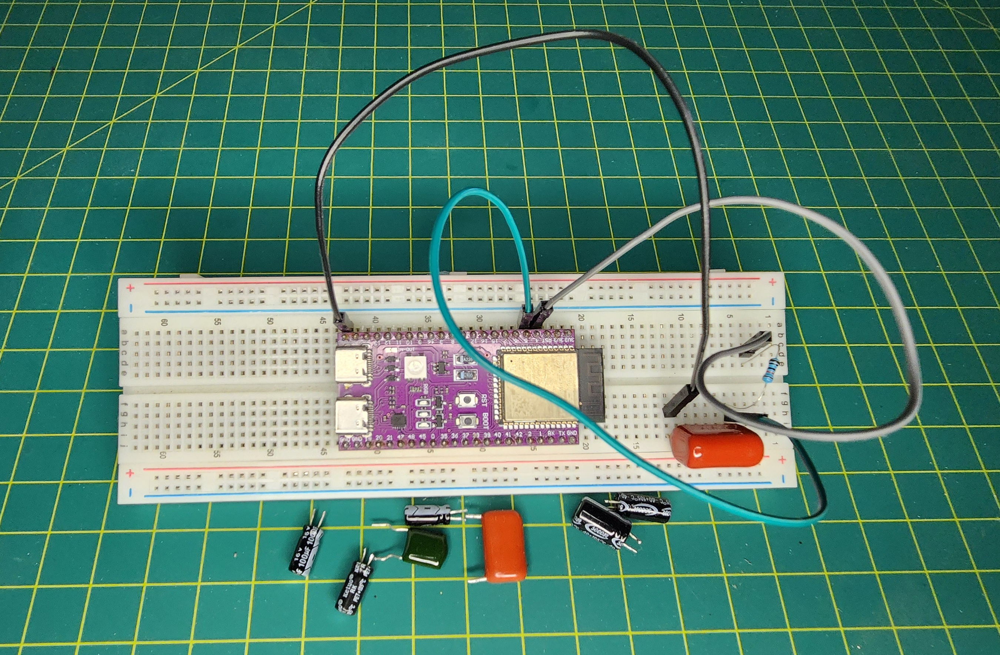
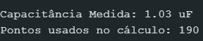

# ⚡ Capacímetro Digital (ESP32-S3)


## 1. Visão Geral e Propósito

Este é um projeto de **hardware e software embarcado de caráter didático**, desenvolvido para validar conceitos de Física (Circuitos RC), Matemática (Regressão Linear), Programação em C++ e Análise de Dados.

O sistema utiliza um microcontrolador **ESP32-S3** para medir a capacitância de componentes desconhecidos através da análise da curva de carga. Diferente de métodos simples que medem apenas o tempo, este projeto aplica **Regressão Linear (Mínimos Quadrados)** sobre múltiplos pontos de amostragem para minimizar ruídos e aumentar a precisão.

> **Nota:** Por ser um projeto caseiro (DIY) montado em protoboard, os resultados possuem uma margem de erro inerente às tolerâncias dos componentes (especialmente do resistor de referência) e ruídos do ADC. O objetivo não é substituir equipamentos de laboratório calibrados, mas demonstrar a aplicação de engenharia de software na resolução de problemas físicos.

---

## 2. Resultados Práticos (Validação)

Para validar a precisão e a versatilidade do algoritmo, foram realizados testes com diferentes tipos de capacitores (Eletrolíticos, Poliéster e Filme). Abaixo estão as médias obtidas.

### Tabela de Medições

| Tipo | Nominal (Real) | Valor Estimado (Média) | Erro Aprox. |
| :--- | :--- | :--- | :--- |
| **Poliéster (2A683J)** | **68 nF** (100V) | **60,00 nF** (0.06µF) | ~11% |
| **Filme (474J)** | **470 nF** (400V) | **450,00 nF** (0.45µF) | ~4.2% |
| **Filme (105K)** | **1.0 µF** (400V) | **1.03 µF** | ~3.0% |
| **Eletrolítico** | **10 µF** (50V) | **10.38 µF** | ~3.8% |
| **Eletrolítico** | **22 µF** (16V) | **23.59 µF** | ~7.2% |
| **Eletrolítico** | **100 µF** (16V) | **107.64 µF** | ~7.6% |
| **Eletrolítico** | **220 µF** (16V) | **215.60 µF** | ~2.0% |

---

## 3. O Hardware: Circuito RC Série

O princípio base é o comportamento de carga de um capacitor em série com um resistor conhecido.

### Esquema de Ligação

O circuito é um filtro RC Série simples, onde o ESP32 atua como fonte e medidor simultaneamente.

```text
          ESP32 GPIO 4 (Fonte 3.3V)
                 │
                 │
           ┌─────┴─────┐
           │  Resistor │ (R_KNOWN = 10kΩ)
           │ Precisão  │
           └─────┬─────┘
                 │
                 ├───> ESP32 GPIO 5 (ADC Leitura)
                 │
           ┌─────┴─────┐
           │ Capacitor │ (DUT - Device Under Test)
           │     C?    │
           └─────┬─────┘
                 │
           ┌─────┴─────┐
           │    GND    │
           └───────────┘
 ```
### Montagem Física (Protótipo)
<div align="center">
  
  <p><i>Implementação prática do circuito RC com ESP32-S3.</i></p>
</div>

### Funcionamento Elétrico
1.  **Carga:** O GPIO 4 aplica 3.3V no circuito. A corrente flui pelo Resistor e começa a acumular cargas no Capacitor.
2.  **Tensão Variável:** A tensão no ponto entre o Resistor e o Capacitor ($V_{out}$) começa em 0V e sobe exponencialmente em direção a 3.3V.
3.  **Leitura:** O GPIO 5 monitora essa subida de tensão milhares de vezes por segundo.

---

## 4. Fundamentos Físicos e Matemáticos

### A Equação Exponencial
A tensão em um capacitor carregando é descrita pela física clássica como:

$$V(t) = V_{in} \cdot (1 - e^{-\frac{t}{R \cdot C}})$$

### Linearização
Para o ESP32 calcular o valor de $C$, transformamos essa curva exponencial em uma **reta** aplicando logaritmo natural ($\ln$):

$$\ln\left(1 - \frac{V(t)}{V_{in}}\right) = -\frac{1}{RC} \cdot t$$

Agora temos uma equação $y = ax$, onde a inclinação ($a$) é $-1/RC$. O ESP32 calcula essa inclinação e isola o $C$:

$$C = -\frac{1}{\text{Slope} \cdot R}$$

---

## 5. Especificações e Limites de Operação

Baseado nos testes práticos com resistor de **10kΩ**, o projeto apresenta a seguinte faixa de operação:

### Faixa de Medição (Range)
* **Mínimo Recomendado: ~50 nF**
    * Abaixo disso, a carga é rápida demais para o ADC capturar pontos suficientes.
* **Máximo Recomendado: ~2200 µF**
    * Acima disso, o tempo de carga torna-se muito longo.

### Tipos Aceitos
* ✅ **Eletrolíticos:** (Filtro "Smart Fit" ativo para ignorar fuga de corrente).
* ✅ **Poliéster / Filme / Cerâmicos:** (Desde que > 50nF).

---

## 6. Lógica do Algoritmo (Firmware)

1.  **Descarga Robusta:** Garante $V=0$ antes de iniciar.
2.  **Amostragem Rápida:** Loop otimizado sem delays artificiais para capturar capacitores pequenos.
3.  **Filtro Smart Fit:** Ignora dados acima de 63.2% da carga ($1\tau$) para evitar erros de *leakage* em eletrolíticos.
4.  **Cálculo:** Aplica Mínimos Quadrados nos dados filtrados.

---

## 7. Entendendo a Amostragem (A Matemática dos Pontos)

Uma dúvida comum é: *"Por que a quantidade de pontos lidos varia tanto de um capacitor para outro?"*

A resposta está na relação entre a velocidade física de carga ($\tau$) e a velocidade de processamento do ESP32.

**A Fórmula dos Pontos:**
O número de pontos úteis ($N$) usados para o cálculo é definido pela razão entre a constante de tempo do circuito e o tempo que o loop do código leva para rodar uma vez:

$$N \approx \frac{R \cdot C}{T_{loop}}$$

Onde:
* **$R$:** Resistência (10.000 $\Omega$)
* **$C$:** Capacitância do componente
* **$T_{loop}$:** Tempo de execução de uma leitura (aprox. 20 a 50 microssegundos no "Modo Turbo")

**Exemplo Prático (Capacitor Rápido - 68nF):**
$\tau = 680\,\mu s$. O ESP32 precisa ser extremamente rápido para conseguir "tirar fotos" desse evento, resultando em poucos pontos (ex: ~15), mas suficientes para a regressão.

**Exemplo Prático (Capacitor Lento - 100µF):**
$\tau = 1.000.000\,\mu s$ (1 segundo). Com o mesmo loop, o ESP32 consegue capturar milhares de pontos, gerando uma resolução estatística altíssima.

---

## 8. Como Interpretar os Resultados

O Serial Monitor exibirá:

1.  **Capacitância Medida:** O valor final calculado.
2.  **Pontos Usados no Cálculo:** O indicador de confiabilidade da leitura.

### Exemplo de Saída Real
Abaixo, um exemplo de leitura de um capacitor de filme de **1.0 µF (105K)**. Note que o sistema utilizou **190 pontos** para realizar a regressão linear com precisão.

<div align="center">
  
</div>

---

## 9. Conclusão

Este projeto demonstra como o poder de processamento do **ESP32-S3** (Dual Core 240MHz + FPU) permite substituir circuitos analógicos complexos por algoritmos de software inteligentes.

Ao utilizar o método de **Regressão Linear nos Mínimos Quadrados**, conseguimos transformar uma leitura de ADC ruidosa em uma medição de capacitância precisa. **Esse range de 50nF a 2200µF cobre 90% dos capacitores usados em eletrônica comum e manutenção, o que torna seu projeto extremamente funcional!**

### Principais Aprendizados
* **A Matemática vence o Ruído:** A regressão estatística elimina a necessidade de filtros de hardware complexos.
* **Adaptação de Software:** A remoção de delays e ajuste de tolerância permitiu ler componentes de tecnologias diferentes (Filme vs Eletrolítico) com o mesmo hardware.
* **Hardware Mínimo:** Com apenas um resistor e o microcontrolador, criamos um instrumento de medição versátil.